<div align="center">
<h1>书单网 网站开源项目</h1>
<p>一个完全免费无门槛的计算机类电子书下载网站</p>
</div>

项目官网：https://bookshelf.plus

开源仓库：<a href="https://github.com/bookshelfplus/bookshelfplus" target="_blank">GitHub</a>  <a href="https://gitee.com/bookshelfplus/bookshelfplus" target="_blank">Gitee</a>


## 简介

当前项目为书单网官网开源项目，你也可以通过这个项目搭建一个属于自己的电子书分享与管理平台。

> 目前项目已上线，网址：https://bookshelf.plus/
>
> 项目介绍视频（B站）：https://www.bilibili.com/video/BV1VT4y1k7Lv

> 项目部分功能仍在开发中，另外文档部分内容尚未更新，部署使用需要掌握一定的技术，如果项目后期看好的人多，将会花精力完善文档以及适当增添新功能。


## 项目许可证

本项目使用 MIT 许可证，但**不得删除或修改项目原作者信息，不得使用本项目作为毕业设计项目，或者将本项目传至诸如CSDN等付费下载平台**。除此之外，不做其他限制，祝您使用愉快 :)


## 开始使用

> 所需环境：Java JDK 8，Maven，MySQL 5.7+，Node.js，Redis等。
>
> MySQL推荐使用8.0以上版本。
>
> 本项目配置项较多，暂未测试宝塔服务器环境，如果可能，建议使用飞豹他环境。

> **下面的配置有些没有说明命令的执行目录，请自行判断。**这部分文档后期将会完善。

### 安装环境

```bash
# 安装 nodejs
# 官方网站：https://nodejs.org/zh-cn/
# 下载地址：https://nodejs.org/dist/v16.14.0/node-v16.14.0-x64.msi

# 安装 JDK 8
# TODO

# 安装 Maven
# TODO

# 安装 MySQL (5.7 以上版本)
# TODO

# 安装 Redis
# TODO

# pm2
npm i pm2 -g

# nodemon (可选)
# 开发使用 nodemon (代码变动后自动重启)
# 使用以下代码安装 nodemon
npm i nodemon -g
```


### 环境配置

#### 配置国内镜像源

##### 配置 npm 国内镜像源

```bash
# 查看当前配置的镜像源 默认为: https://registry.npmjs.org/
npm config get registry

# 修改为国内镜像源 这里使用淘宝镜像源: https://registry.npm.taobao.org/
npm config set registry https://registry.npm.taobao.org/
```


##### 配置 Maven 国内镜像源

编辑 Maven 安装目录下 `conf/settings.xml` 文件，如下

```xml
  <mirrors>
    <!-- mirror
     | Specifies a repository mirror site to use instead of a given repository. The repository that
     | this mirror serves has an ID that matches the mirrorOf element of this mirror. IDs are used
     | for inheritance and direct lookup purposes, and must be unique across the set of mirrors.
     |
    <mirror>
      <id>mirrorId</id>
      <mirrorOf>repositoryId</mirrorOf>
      <name>Human Readable Name for this Mirror.</name>
      <url>http://my.repository.com/repo/path</url>
    </mirror>
     -->
    <!-- ######### 从这里开始 ######### -->
    <mirror>
      <id>alimaven</id>
      <name>aliyun maven</name>
      <url>https://maven.aliyun.com/repository/public</url>
      <mirrorOf>central</mirrorOf>
    </mirror>
    <!-- ######### 到这里结束 ######### -->
  </mirrors>
```


### 下载项目

#### 方式1: 在 Release 页面下载压缩包

访问以下网址（国内推荐使用Gitee），下载最新版代码包并解压即可
https://gitee.com/bookshelfplus/bookshelfplus/releases

https://github.com/bookshelfplus/bookshelfplus/releases


#### 方式2: 克隆 Git 代码仓库

```bash
# 首先，先切换到希望克隆到的本地路径。之后克隆项目会在该目录下创建一个 bookshelf 文件夹
# 例如，您可以切换到用户 家 目录
# cd ~/

# 通过 码云 克隆 （也可通过 GitHub 克隆）
git clone https://gitee.com/bookshelfplus/bookshelfplus
# git clone https://github.com/bookshelfplus/bookshelfplus

# 进入克隆的项目文件夹
cd ./bookshelfplus

# 切换到 master 分支下
git checkout master

# 设置文件夹权限 (Windows 用户可跳过此步，Linux 用户需要设置)
# TODO
```


### 项目配置

#### 配置 nginx.conf

参考配置如下（此处仅列出核心配置，完整配置文件可以参考[这里](./server/nginx/conf/nginx.conf)）

```

http {
    upstream frontendNodejsServer {
        server 127.0.0.1:3000;
    }
    upstream backendSpringbootServer {
        server 127.0.0.1:8090;
    }
    server {
        listen 80;
        server_name localhost;
        # server_name bookshelf.plus;

        #禁止访问的文件或目录
        location ~ ^/(\.user.ini|\.htaccess|\.git|LICENSE|README.md)
        {
            return 404;
        }

        location / {
            proxy_pass http://frontendNodejsServer;
            index index.html index.htm;
        }

        location /api/ {
            proxy_set_header Host $host;
            proxy_set_header X-Real-IP $remote_addr;
            proxy_set_header X-Forwarded-For $proxy_add_x_forwarded_for;
            proxy_pass http://backendSpringbootServer/api/;
            index index.html index.htm;
        }
    }
}
```


```bash
# 配置 nginx.conf
# TODO

# [前端]
# 配置后台 Api 地址
# TODO
# 配置前端网站名称
# TODO

# [后端]
# 配置 MySQL 数据库地址
# TODO
# 配置 Redis 地址
# TODO
# 配置第三方登录
# TODO thirdparty.sample.properties -> thirdparty.properties
```

配置好后，需要重启 nginx

```bash
# 重启 nginx
nginx -s reload
# 或者使用其他重启命令
# 例如 Ubuntu 系统下使用 systemctl restart nginx
```


### 处理依赖

```bash
# [前端]
npm install

# [后端]
mvn clean install
```


### 数据导入

```bash
# [数据库]
# 导入数据库 SQL 脚本
# TODO
```


### 编译后端项目

```bash
mvn clean install

# 如果提示: Cannot create resource output directory: xxx
# 那么说明权限不够，在前面加上 sudo
# sudo mvn clean install
```

编译成功后，可以看到如下输出（其中有 `BUILD SUCCESS`）：

```bash
[INFO] ------------------------------------------------------------------------
[INFO] BUILD SUCCESS
[INFO] ------------------------------------------------------------------------
[INFO] Total time:  12:17 min
[INFO] Finished at: 2022-04-03T14:22:18+08:00
[INFO] ------------------------------------------------------------------------
```


### 创建云服务（腾讯云）

#### 对象存储（COS）

> 本项目云服务使用腾讯云，其他云厂商暂不支持。开始之前，你需要有一个腾讯云账号。
>
> 请注意，使用云服务可能会产生费用，使用前请您详细了解相关服务的收费策略，以免产生不必要的费用。

##### 创建存储桶

> 仅支持腾讯云 COS 存储桶，其他云厂商的对象存储暂不支持。

> 需要为本服务单独创建存储桶，不支持和其他业务共用一个存储桶。

首先登录腾讯云控制台，进入对象存储页面：

https://console.cloud.tencent.com/cos/bucket

点击创建存储桶。

创建COS存储桶的时候一定要创建在CSF可用区域。（建议选择上海，因为后面创建云函数需要与对象存储在同一地域，而云函数只支持以下地区）

> - 华南地区：广州
> - 华东地区：上海
> - 华北地区：北京
> - 西南地区：成都

【TODO】图需要更新

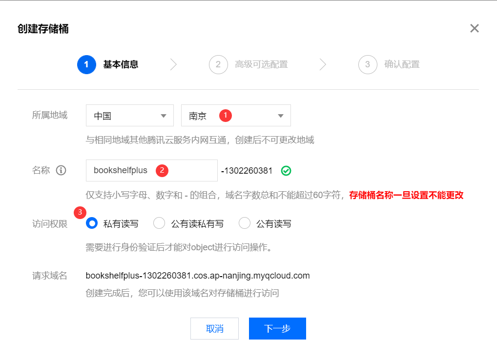

高级可选配置可以根据自己实际需求进行配置，此处保持默认不做更改。

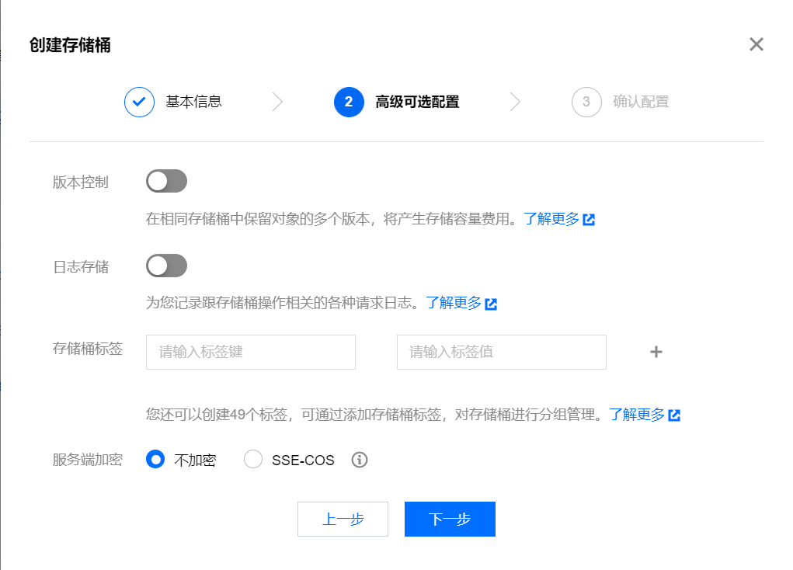

点击创建，完成存储桶的创建。

【TODO】图需要更新

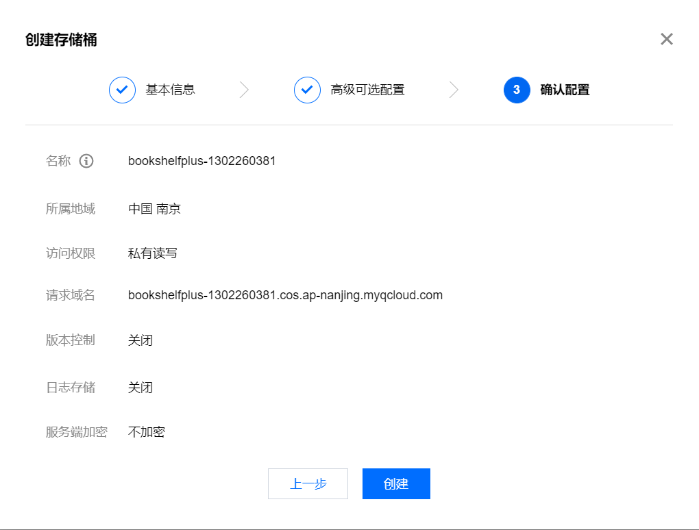


##### 配置存储桶

###### 配置跨域访问

由于腾讯云存储桶和我们的业务域名不在同一主域下，所以需要配置 CORS 跨域访问，否则浏览器请求的时候会出现报错，无法完成请求。

> 如果您不了解 CORS 是什么的话，建议您阅读一下这篇 MDN 文档：[跨源资源共享CORS](https://developer.mozilla.org/zh-CN/docs/Web/HTTP/CORS)（其中的描述可能有些专业，大概看看就好）
>
> 也可以看一下腾讯云的官方文档：[设置跨域访问](https://cloud.tencent.com/document/product/436/13318)

这里添加一条**跨域访问CORS规则**

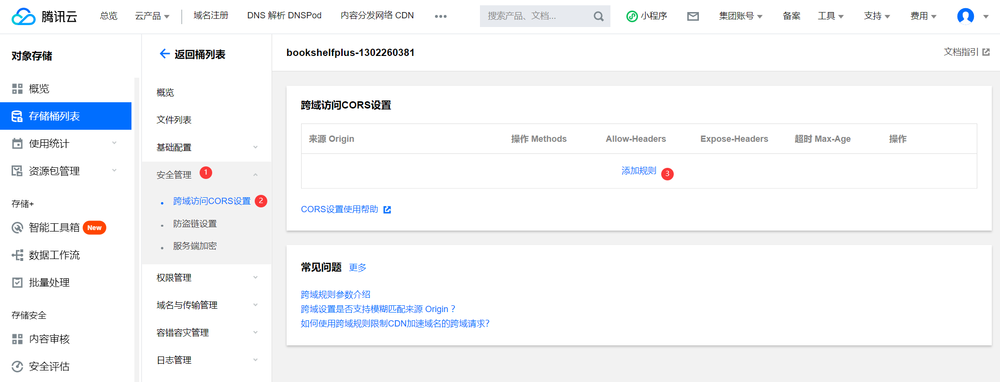

**来源 Origin** 填写自己的业务域名，注意后续对存储桶的请求需要通过此域名发出。如果您只是自己本地测试，方便起见可以直接填写 `*` ，但是如果您希望向他人分享，您最好还是设置一下，否则容易被别人刷流量。

**操作 Methods** 可以全部勾上。目前项目使用到的由 `PUT`，`GET` 和 `DELETE` 三种。

其余配置保持默认即可。

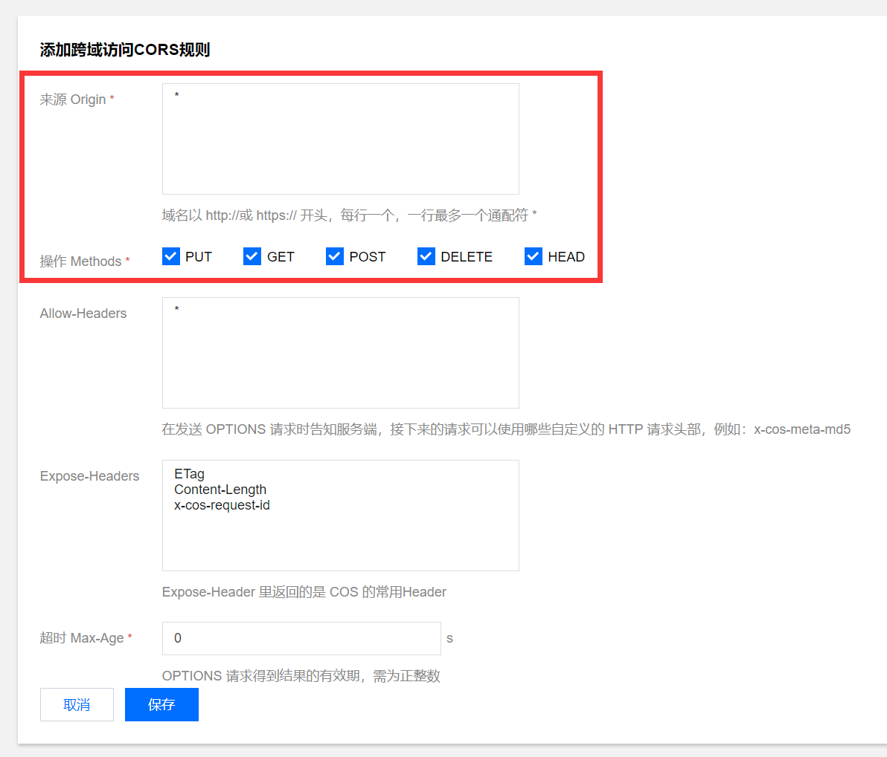

配置好后点击保存即可。


###### 配置防盗链（可选）

这个配置不配不会影响业务正常使用，但是强烈建议您配置一下。因为不配置的话其他人可以将您的下载链接嵌入他们的网站，这样的话您需要为其支付费用。

> referer 在浏览器发请求的时候会将所在的网站域名通过 referer 请求标头发给服务端。③ 空 referer 一般指的是用户直接访问资源链接，而不是通过点击网页上的超链接访问的情景（也可能是通过设置了不发送 referer 请求头的网页访问过来），自己视情况设置。
>
> 防盗链可以参考腾讯云官方文档：[防盗链](https://cloud.tencent.com/document/faq/436/56651)

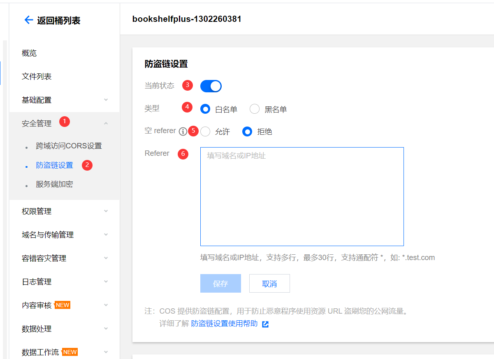

>需要注意的是，http 和 https ，www 和 不带www 需要都需要配置。
>
>例如，若您配置后用户可以通过 http://bookshelf.plus、http://www.bookshelf.plus、https://bookshelf.plus、https://www.bookshelf.plus 域名访问到，那么需要配置如下：
>
>```
>http://bookshelf.plus
>http://www.bookshelf.plus
>https://bookshelf.plus
>https://www.bookshelf.plus
>```
>
>若您在二级域名下部署，例如 site.bookshelf.plus ，那么需要配置如下：
>
>```
>http://site.bookshelf.plus
>https://site.bookshelf.plus
>```
>
>对于上述几种情况，您也可以使用通配符，以允许域名下所有子域对资源的访问。
>
>```
>http://*.bookshelf.plus
>https://*.bookshelf.plus
>```


###### 配置自定义 CDN 加速域名（TODO）

> 参考腾讯云官方文档：[CDN 加速域名](https://cloud.tencent.com/document/faq/436/56558)

TODO

上传：后端生成带有效期的预授权URL，前端使用这个 URL 进行上传。

下载：后端计算好 CDN 回源鉴权返回给前端，前端通过这个鉴权 URL 下载文件。


##### 配置日志记录（可选）

如果您需要开启日志记录，可以按照下图步骤进行配置，如果不需要就不配置。

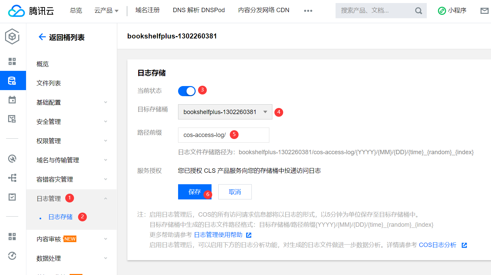


#### 云函数（Serverless 函数服务）

> 为什么要创建云函数？
>
> 云函数对象存储文件上传成功时触发，后台上传文件后通过该云函数告知后端服务文件上传成功，以便后端服务及时更新数据库中记录及进行进一步处理。
>
> 不创建可以吗？
>
> 可以，但不推荐。如果不创建，那么上传文件后部分弱网情况下后端文件上传状态不会更新，需要手动点击刷新才会更新。

##### 创建 Serverless 函数

> 腾讯云官方文档：COS 触发器说明
> https://cloud.tencent.com/document/product/583/9707

> 注意，一个存储桶同一个类别的触发事件仅能选择一个

打开腾讯云控制台 Serverless后台：https://console.cloud.tencent.com/scf/list

点击新建。

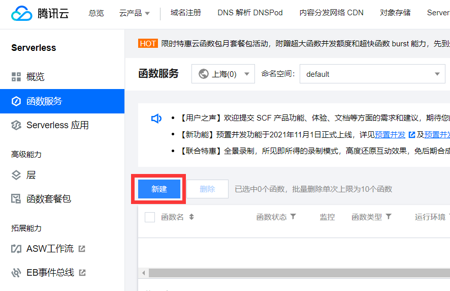

**基础配置：**修改如下信息。

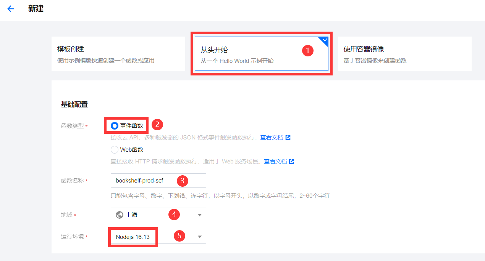

**函数代码：**选择在线编辑，执行方法保持默认（`index.main_handler`）。

将项目文件夹下 [utils/QCloudSCF/index.js](utils/QCloudSCF/index.js) 代码文件中内容粘贴至下方在线编辑器（在线编辑器中的默认内容需要删除）。

> 注意，图中 ③ 处请修改为您自己的域名（例如网站部署在 `abc.example.com`，此处就填写 `abc.example.com`），若您的网站配置了多个域名，选择其中一个可以访问后台api的域名填写即可。

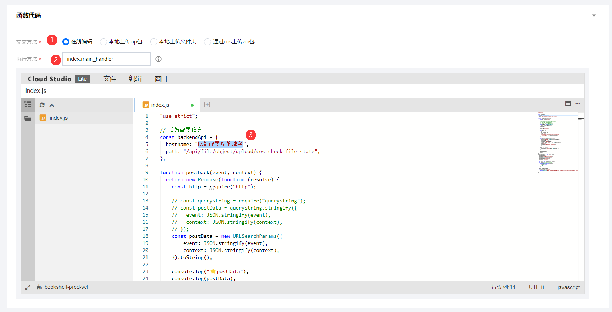

**高级配置**：保持默认即可。

**触发器配置：**`创建触发器` 处选择 `自定义创建`。

> 前缀过滤：不填
>
> 后缀过滤：不填

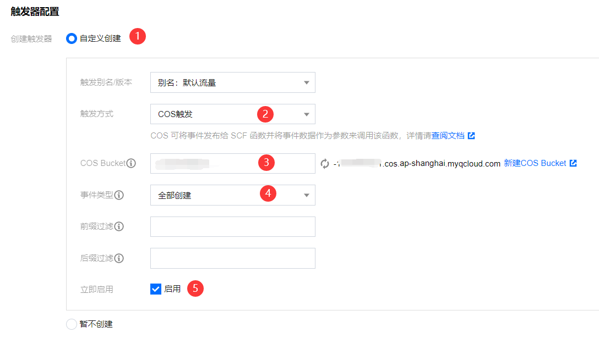

点击完成，创建成功。

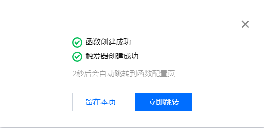。

稍等一下，等待部署完成后，会自动跳转到函数管理页面。

创建成功后，建议将 `执行超时时间` 适当调大一点，特别是当服务器和腾讯云COS节点较远的情况，以减少因网络问题导致COS文件上传后网站后台不能及时感知。一般建议大于 `5秒`，此处调为 `10秒`。

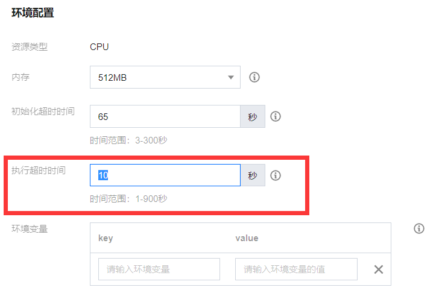


#### 生成 SecretId、SecretKey

> 有两种方式，一种是创建子用户，然后生成子用户的SecrectKey，另一种是直接生成当前账号的SecrectKey。两种方式均可。如果您对权限管理有需求，建议使用第一种；如果您希望尽可能简单的配置，可以使用第二种。如果您不确定使用哪种，那么请用第一种。

##### 第1种：创建子用户

登录腾讯云后台，进入访问管理下的用户列表页：https://console.cloud.tencent.com/cam

点击新建用户

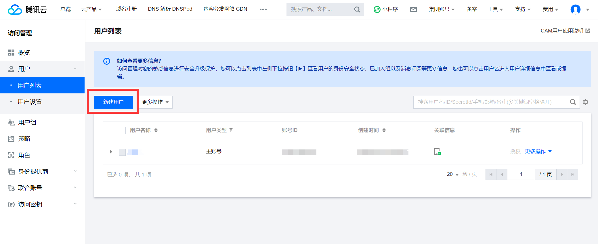

点击快速创建。

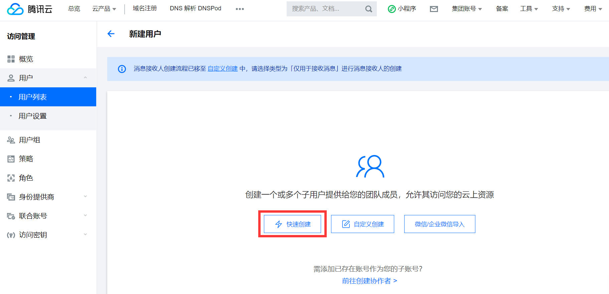

接下来这里有四个地方需要配置。下图仅标出需要配置的项目，具体应该配置成什么请继续往下看。

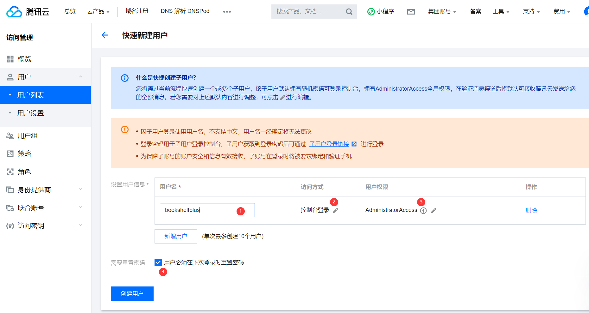

> ① 用户名：自己随便起一个，满足要求即可。（用户名创建后不可以修改）
>
> ② 访问方式：修改为编程访问。
>
> 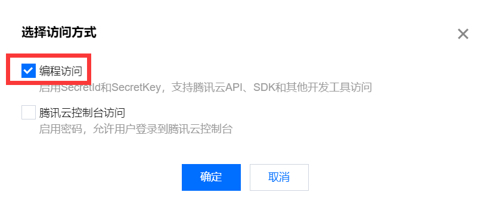
>
> ③ 用户权限：
>
> <1> 取消 `AdministratorAccess` 权限；
>
> <2> 搜索 `QcloudCOSDataFullControl` ，并勾选 `QcloudCOSDataFullControl` （对象存储（COS）数据读、写、删除、列出的访问权限）
>
> 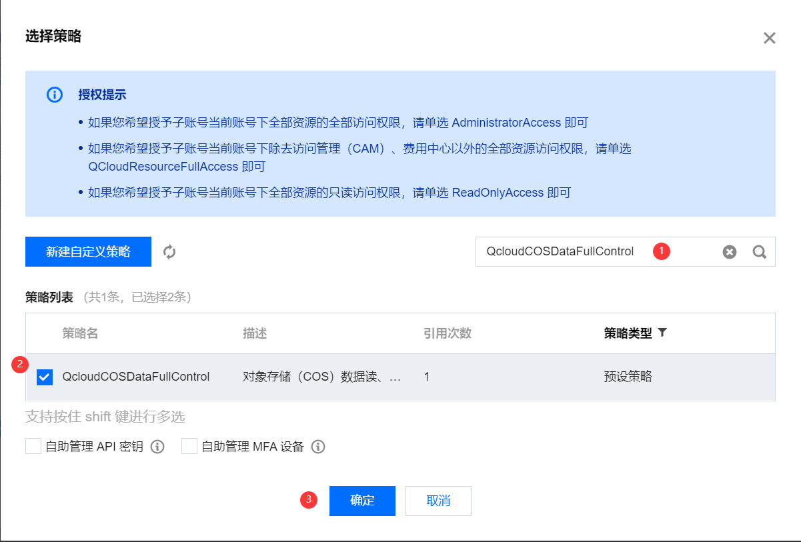
>
> ④ 根据自己的情况选择即可

点击创建用户，用户创建成功，获得密钥。

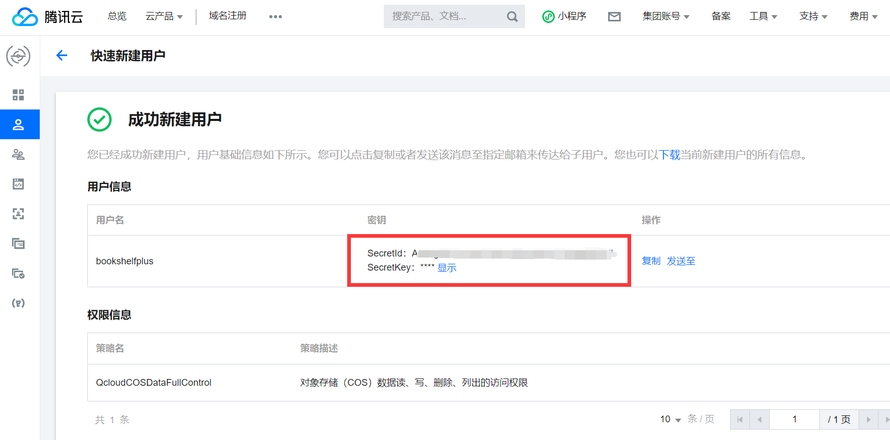


##### 第2种：直接生成

访问：https://console.cloud.tencent.com/cam/capi

点击继续使用。


点击新建密钥。

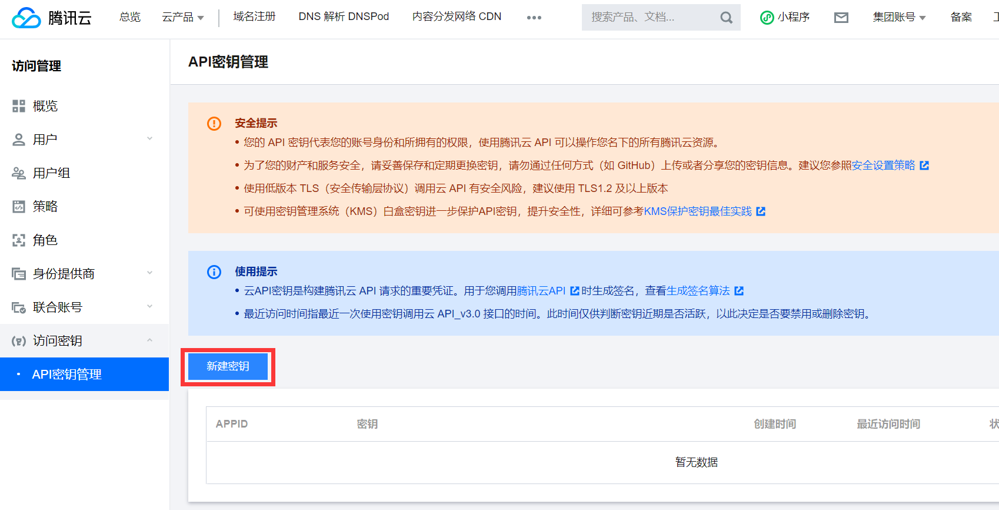

密钥创建完成。

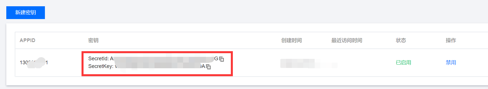


### 启动项目

```bash
# [前端]
# 启动前端服务 (默认监听 3000 端口)
npm run prod


# [后端]
# 启动后端服务 (默认监听 8090 端口)
# mvn install -Djar.forceCreation spring-boot:run
java -jar ./bookshelfplus/target/bookshelfplus-1.0-SNAPSHOT.jar

# 在后台执行：
# java -jar ./bookshelfplus/target/bookshelfplus-1.0-SNAPSHOT.jar &

# 如果提示: Cannot create resource output directory: xxx
# 那么说明权限不够，在前面加上 sudo

# 启动 nginx
# TODO
```

若启动时提示以下 `WARNING`，是因为 `JDK` 版本过高，一般不影响使用。

```bash
WARNING: An illegal reflective access operation has occurred
WARNING: Illegal reflective access by com.google.inject.internal.cglib.core.$ReflectUtils$1 (file:/usr/share/maven/lib/guice.jar) to method java.lang.ClassLoader.defineClass(java.lang.String,byte[],int,int,java.security.ProtectionDomain)
WARNING: Please consider reporting this to the maintainers of com.google.inject.internal.cglib.core.$ReflectUtils$1
WARNING: Use --illegal-access=warn to enable warnings of further illegal reflective access operations
WARNING: All illegal access operations will be denied in a future release
```


### 验证是否部署成功

#### 查看后端运行状态

```bash
# 查看后端运行状态
# ps -A | grep java
ubuntu@xxxxxx:~$ ps -A | grep java
 558861 ?        00:00:13 java

# 结束在后台运行的 Java 进程
# sudo kill -9 [端口号]
ubuntu@xxxxxx:~$ sudo kill -9 558861
```


#### 验证云函数是否配置成功

检查云函数是否能与后端服务进行交互

点击云函数名称，进入云函数详情页面。

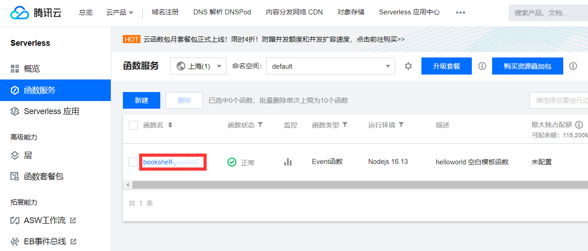

切换到“函数代码”标签页（如下图）。

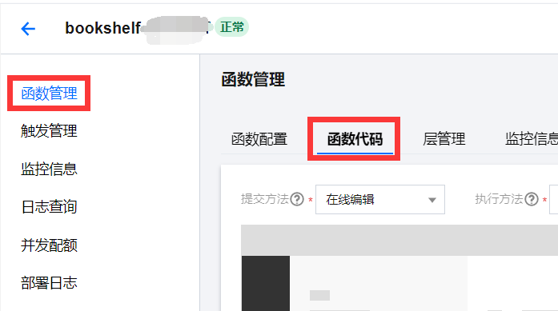

将测试模板切换为 `COS 对象存储的 PUT 事件模板`。

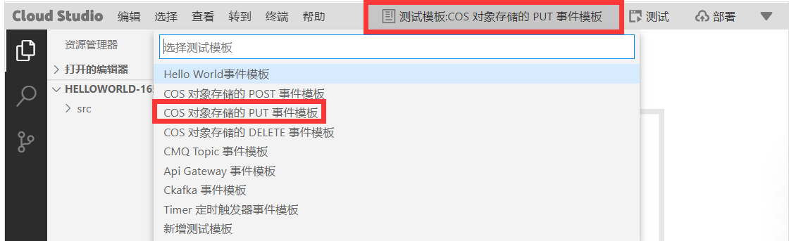

往下滑动，编辑器下方有两个按钮，分别是**部署**和**测试**。

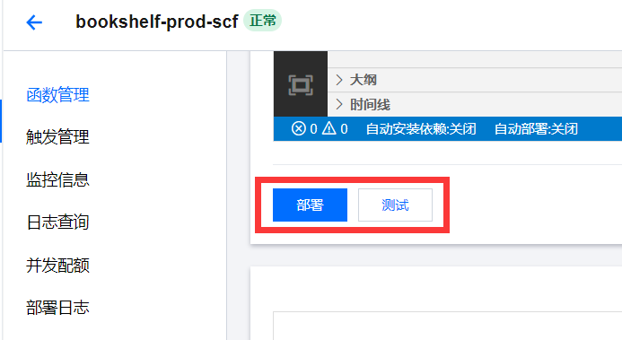

> 注意，每次在修改云函数的代码后都需要点击**部署**按钮，所做的修改才会被更新。

我们点击**测试**，如果您看到如下返回信息，说明您的后端服务和云函数已经部署成功。

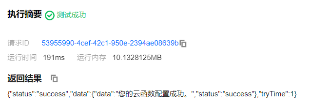

返回结果类似于：

```json
{"status":"success","data":{"data":"您的云函数配置成功。","status":"success"},"tryTime":1}
```

> 您还可能见到如下错误：
>
> **请求超时**： `Invoking task timed out after 3 seconds`
>
> 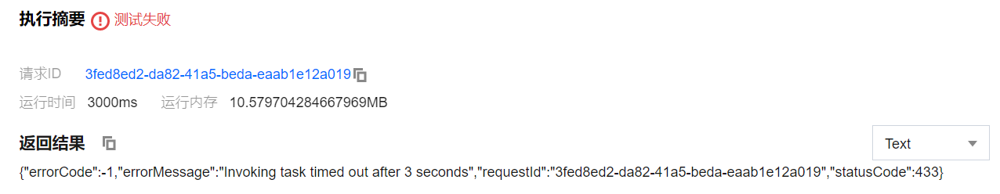
>
> 返回结果类似于：
>
> ```json
> {"errorCode":-1,"errorMessage":"Invoking task timed out after 3 seconds","requestId":"3fed8ed2-da82-41a5-beda-eaab1e12a019","statusCode":433}
> ```
>
> 解决方法：可以尝试调大云函数的超时时间（函数管理→函数配置→右上角**编辑**→环境配置分类下面执行超时时间适当调大一点）。如果调大超时时间后仍然不行，那么说明云函数无法访问到后端服务，请检查后端服务是否已经部署并启动，云函数中的域名是否配置正确。
>
>
>
> **未创建 COS 触发器**：`JSON解析出错！`
>
> 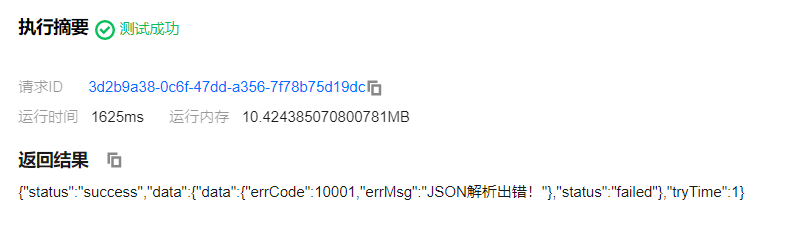
>
> 返回结果类似于：
>
> ```json
> {"status":"success","data":{"data":{"errCode":10001,"errMsg":"JSON解析出错！"},"status":"failed"},"tryTime":1}
> ```
>
> 解决方法：检查您的云函数“触发管理”页面是否已创建如下触发器。如果没有或不正确，请创建或修改为正确配置。
>
> 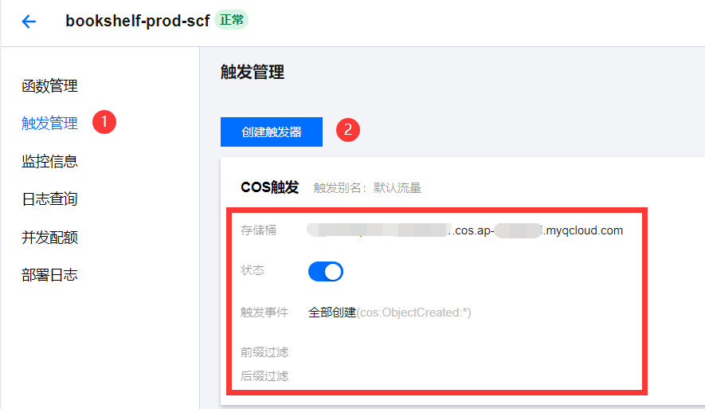
>
>
>
> 如果您还遇到了其他返回结果，请参考错误提示进行处理。


## 停止项目

```bash
# 停止 nginx
# 有如下几种停止方式
nginx -s quit # 从容停止
nginx -s stop # 立即停止
systemctl stop nginx # 使用 systemctl 停止
# 也可直接杀掉 nginx 进程

# 停止前端服务
npm run prod-stop

# 停止后端服务
# TODO
```


## 其他命令

```bash
# 清除前端字体缓存
node ./bookshelfplus-frontend/cleanup.js
```


## 功能展示

### 功能列表（TODO）

- [x] 首页。简约，一个搜索框就够了。后期考虑添加热门搜索功能。
- [x] 书籍列表页，也是搜索结果页。就是一个书单列表，带分页功能。
- [x] 书籍详情页。主要是显示书籍的各种详细信息（书名，简介，缩略图等），还有下载方式，同时还有反馈功能（连接失效反馈，版权问题申诉下架等）
- [x] 分类列表页
- [x] 分类详情页
- [x] 管理员后台。
- [x] 用户登录后台。

### 功能截图

【TODO】截图待补充...


## 项目架构

> 项目前后端分离开发，使用了不同的技术，通过nginx进行反向代理

**前端**采用`nodejs`开发，使用`axios`、`jQuery`等组件。

**后端**采用`SpringBoot`开发，数据库连接使用`mybatis`、`alibaba druid`，接口文档生成使用`swagger2`，参数验证采用`hibernate`，日期时间处理使用`joda-time`工具类，同时还使用了`lombok`简化代码。

**数据库**采用`MySQL`，会话缓存采用`redis`。

**反向代理**使用`nginx`。

**对象存储**对接腾讯云COS存储（`cos_api`）。

**第三方登录**使用 `JustAuth` 开源项目（配合 `okhttp3`）


## 开发工具

前端：VS Code，后端：idea，数据库：Navicat

> 以上为项目开发时所使用的开发工具，也可以使用其他的开发工具打开，但建议使用以上工具打开本项目，避免产生一些莫名错误。


## 疑难解答

### 动态压缩字体技术

项目使用了动态压缩字体技术，因为中文字体包过大，无法快速加载，所以在用户访问网页加载完成后，使用js取得页面上显示的所有文字，然后发回给后端，后端返回一个压缩后的字体包。

由于页面上显示的文字相对字体包而言很少，所以压缩后的字体基本上只有几十K到几百K，这样便于网络传输。


## 常见问题 FAQ

### Nginx 无法启动

【问题特征】启动时，报如下错误：

```bash
nginx: [emerg] CreateFile() "xxxxxxx/nginx.conf" failed (1113: No mapping for the Unicode character exists in the target multi-byte code page)
```

【问题原因】

nginx启动目录不能包含中文，否则无法启动

【解决方法】

将 nginx 安装到不包含中文和特殊字符的目录中


### 项目启动后，自定义字体加载失败

【问题原因】

因为项目文件夹的权限不够，导致无法生成字体文件，进而导致前端访问不到字体文件。

【解决方法】

修改项目文件夹的权限和用户组，参考命令如下（修改成你自己的配置，不要直接执行）

```bash
# 修改用户组
sudo chown -R www-data:www-data bookshelf.plus/
# www-data:www-data 改成你自己的用户组；bookshelf.plus/改成你本项目的文件夹

# 修改权限
chmod -R 755 bookshelf.plus/
```


### 项目启动后，可以看到项目界面，但是无法查询、登录等

【问题原因】

可能是后端服务没有成功启动

【解决方法】

首先点击页脚的“网站状态检测”，看看后台服务器能否正常连接。

如果能够连接，那么就是后端与数据库之间的连接出现了问题。

> 例如数据库没开，数据库没有导入SQL文件，后端的数据库连接信息配置错误等等

如果不能连接，那么就是后端服务的问题，检查一下后端服务是否已经打开了。


### 云服务器上，项目启动成功，但是无法访问网页

【问题原因】

可能是 nginx 文件配置错误，或者服务器的端口没有对外开放

【解决方法】

检查一下

- 云服务器的“安全组”（不同厂商有不同的叫法）中是否开放了80端口
- nginx 配置是否正确（主要看 `server_name`, `listen`, `location` 等配置）


### 项目启动后，DruidDataSource 疯狂报错 create connection SQLException, ...

【错误原因】数据库访问不了

【解决方法】

检查一下数据库是否开启，配置文件中的数据库配置是否正确，以及配置的 MySQL 用户是否有访问权限

【错误日志】

```bash
2022-04-25 00:34:32.726 ERROR 18344 --- [reate-335731589] com.alibaba.druid.pool.DruidDataSource   : create connection SQLException, url: jdbc:mysql://127.0.0.1:3306/bookshelfplus?useSSL=false&serverTimezone=Asia/Shanghai, errorCode 0, state 08S01

com.mysql.cj.jdbc.exceptions.CommunicationsException: Communications link failure

The last packet sent successfully to the server was 0 milliseconds ago. The driver has not received any packets from the server.
	at com.mysql.cj.jdbc.exceptions.SQLError.createCommunicationsException(SQLError.java:174) ~[mysql-connector-java-8.0.28.jar:8.0.28]
	at com.mysql.cj.jdbc.exceptions.SQLExceptionsMapping.translateException(SQLExceptionsMapping.java:64) ~[mysql-connector-java-8.0.28.jar:8.0.28]
	at com.mysql.cj.jdbc.ConnectionImpl.createNewIO(ConnectionImpl.java:829) ~[mysql-connector-java-8.0.28.jar:8.0.28]
	at com.mysql.cj.jdbc.ConnectionImpl.<init>(ConnectionImpl.java:449) ~[mysql-connector-java-8.0.28.jar:8.0.28]
	at com.mysql.cj.jdbc.ConnectionImpl.getInstance(ConnectionImpl.java:242) ~[mysql-connector-java-8.0.28.jar:8.0.28]
	at com.mysql.cj.jdbc.NonRegisteringDriver.connect(NonRegisteringDriver.java:198) ~[mysql-connector-java-8.0.28.jar:8.0.28]
	at com.alibaba.druid.pool.DruidAbstractDataSource.createPhysicalConnection(DruidAbstractDataSource.java:1657) ~[druid-1.2.8.jar:1.2.8]
	at com.alibaba.druid.pool.DruidAbstractDataSource.createPhysicalConnection(DruidAbstractDataSource.java:1723) ~[druid-1.2.8.jar:1.2.8]
	at com.alibaba.druid.pool.DruidDataSource$CreateConnectionThread.run(DruidDataSource.java:2838) ~[druid-1.2.8.jar:1.2.8]
Caused by: com.mysql.cj.exceptions.CJCommunicationsException: Communications link failure

The last packet sent successfully to the server was 0 milliseconds ago. The driver has not received any packets from the server.
	at sun.reflect.GeneratedConstructorAccessor59.newInstance(Unknown Source) ~[na:na]
	at sun.reflect.DelegatingConstructorAccessorImpl.newInstance(DelegatingConstructorAccessorImpl.java:45) ~[na:1.8.0_201]
	at java.lang.reflect.Constructor.newInstance(Constructor.java:423) ~[na:1.8.0_201]
	at com.mysql.cj.exceptions.ExceptionFactory.createException(ExceptionFactory.java:61) ~[mysql-connector-java-8.0.28.jar:8.0.28]
	at com.mysql.cj.exceptions.ExceptionFactory.createException(ExceptionFactory.java:105) ~[mysql-connector-java-8.0.28.jar:8.0.28]
	at com.mysql.cj.exceptions.ExceptionFactory.createException(ExceptionFactory.java:151) ~[mysql-connector-java-8.0.28.jar:8.0.28]
	at com.mysql.cj.exceptions.ExceptionFactory.createCommunicationsException(ExceptionFactory.java:167) ~[mysql-connector-java-8.0.28.jar:8.0.28]
	at com.mysql.cj.protocol.a.NativeSocketConnection.connect(NativeSocketConnection.java:89) ~[mysql-connector-java-8.0.28.jar:8.0.28]
	at com.mysql.cj.NativeSession.connect(NativeSession.java:120) ~[mysql-connector-java-8.0.28.jar:8.0.28]
	at com.mysql.cj.jdbc.ConnectionImpl.connectOneTryOnly(ConnectionImpl.java:949) ~[mysql-connector-java-8.0.28.jar:8.0.28]
	at com.mysql.cj.jdbc.ConnectionImpl.createNewIO(ConnectionImpl.java:819) ~[mysql-connector-java-8.0.28.jar:8.0.28]
	... 6 common frames omitted
Caused by: java.net.ConnectException: Connection refused: connect
	at java.net.DualStackPlainSocketImpl.connect0(Native Method) ~[na:1.8.0_201]
	at java.net.DualStackPlainSocketImpl.socketConnect(DualStackPlainSocketImpl.java:79) ~[na:1.8.0_201]
	at java.net.AbstractPlainSocketImpl.doConnect(AbstractPlainSocketImpl.java:350) ~[na:1.8.0_201]
	at java.net.AbstractPlainSocketImpl.connectToAddress(AbstractPlainSocketImpl.java:206) ~[na:1.8.0_201]
	at java.net.AbstractPlainSocketImpl.connect(AbstractPlainSocketImpl.java:188) ~[na:1.8.0_201]
	at java.net.PlainSocketImpl.connect(PlainSocketImpl.java:172) ~[na:1.8.0_201]
	at java.net.SocksSocketImpl.connect(SocksSocketImpl.java:392) ~[na:1.8.0_201]
	at java.net.Socket.connect(Socket.java:589) ~[na:1.8.0_201]
	at com.mysql.cj.protocol.StandardSocketFactory.connect(StandardSocketFactory.java:156) ~[mysql-connector-java-8.0.28.jar:8.0.28]
	at com.mysql.cj.protocol.a.NativeSocketConnection.connect(NativeSocketConnection.java:63) ~[mysql-connector-java-8.0.28.jar:8.0.28]
	... 9 common frames omitted
```


### 项目启动报错 Error parsing HTTP request header

【问题原因】客户端没有按照规范发HTTP请求

【解决方法】不影响项目运行，无需修改，可忽略该错误

【错误日志】

```bash
2022-04-25 00:19:43.698  INFO 434027 --- [nio-8090-exec-1] o.apache.coyote.http11.Http11Processor   : Error parsing HTTP request header
 Note: further occurrences of HTTP request parsing errors will be logged at DEBUG level.

java.lang.IllegalArgumentException: Invalid character found in method name [0x030x000x00/*0xe00x000x000x000x000x00Cookie: ]. HTTP method names must be tokens
	at org.apache.coyote.http11.Http11InputBuffer.parseRequestLine(Http11InputBuffer.java:419) ~[tomcat-embed-core-9.0.60.jar:9.0.60]
	at org.apache.coyote.http11.Http11Processor.service(Http11Processor.java:271) ~[tomcat-embed-core-9.0.60.jar:9.0.60]
	at org.apache.coyote.AbstractProcessorLight.process(AbstractProcessorLight.java:65) ~[tomcat-embed-core-9.0.60.jar:9.0.60]
	at org.apache.coyote.AbstractProtocol$ConnectionHandler.process(AbstractProtocol.java:889) ~[tomcat-embed-core-9.0.60.jar:9.0.60]
	at org.apache.tomcat.util.net.NioEndpoint$SocketProcessor.doRun(NioEndpoint.java:1743) ~[tomcat-embed-core-9.0.60.jar:9.0.60]
	at org.apache.tomcat.util.net.SocketProcessorBase.run(SocketProcessorBase.java:49) ~[tomcat-embed-core-9.0.60.jar:9.0.60]
	at org.apache.tomcat.util.threads.ThreadPoolExecutor.runWorker(ThreadPoolExecutor.java:1191) ~[tomcat-embed-core-9.0.60.jar:9.0.60]
	at org.apache.tomcat.util.threads.ThreadPoolExecutor$Worker.run(ThreadPoolExecutor.java:659) ~[tomcat-embed-core-9.0.60.jar:9.0.60]
	at org.apache.tomcat.util.threads.TaskThread$WrappingRunnable.run(TaskThread.java:61) ~[tomcat-embed-core-9.0.60.jar:9.0.60]
	at java.base/java.lang.Thread.run(Thread.java:829) ~[na:na]
```


### 其他问题

以上仅列出了部分常见问题，如果您没有找到相关解决方法，可以在 Gitee 或 GitHub 仓库中创建一个 issue。提问时请注意要尽可能详细地描述问题，以及社区提问基本礼仪。


## 联系我们

目前该项目由 程序员小墨 独立开发，你可以在 [GitHub](https://github.com/coder-xiaomo)、[Gitee](https://gitee.com/coder-xiaomo)、[B站](https://space.bilibili.com/457109942)或微信公众号等平台找到我（所有平台都是“程序员小墨”这个名字）。

如您希望合作，或者共同维护本项目，可以通过 `admin@only4.work` 与我取得联系。邮件主题中请注明 `[书栖网丨开源项目]` 方便我们快速了解您的来意，谢谢。

精力有限，暂不提供免费客服服务，如您遇到问题，请自行搜索解决。这类相关邮件我们将不予回复，望理解！
