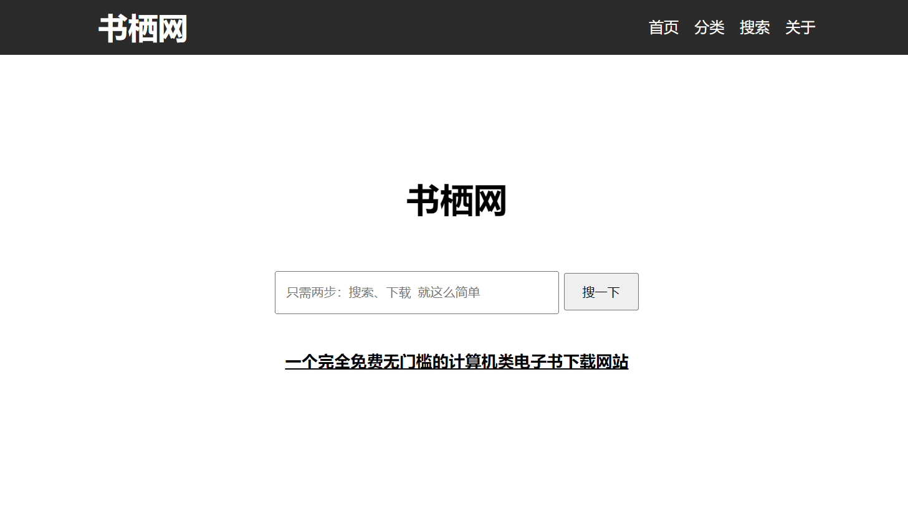

<div align="center">
<h1>书栖网 网站开源项目</h1>
<p>一个完全免费无门槛的计算机类电子书下载网站</p>
</div>

项目官网：https://bookshelf.plus

开源仓库：<a href="https://github.com/bookshelfplus/bookshelfplus" target="_blank">GitHub</a>  <a href="https://gitee.com/bookshelfplus/bookshelfplus" target="_blank">Gitee</a>



## 简介

前项目为书栖网官网开源项目，你也可以通过这个项目搭建一个属于自己的电子书分享与管理平台。

> 如需获取计算机类电子书，请访问https://bookshelf.plus/ ，或前往Git仓库👉（[GitHub](https://github.com/only-4/computer-related-books)、[Gitee](https://gitee.com/only4/computer-related-books)）


## 项目许可证

本项目使用 MIT 许可证，但**不得使用本项目作为毕业设计项目，或者将本项目传至诸如CSDN等付费下载平台**。除此之外，不做其他限制，祝您使用愉快 :)


## 开始使用

> 所需环境：Java JDK 8，Maven，MySQL 5.7+，nodejs，Redis等

> **下面的配置有些没有说明命令的执行目录，请自行判断。**这部分文档后期将会完善。

### 安装环境

```bash
# 安装 nodejs
# 官方网站：https://nodejs.org/zh-cn/
# 下载地址：https://nodejs.org/dist/v16.14.0/node-v16.14.0-x64.msi

# 安装 JDK 8
# TODO

# 安装 Maven
# TODO

# 安装 MySQL (5.7 以上版本)
# TODO

# 安装 Redis
# TODO

# pm2
npm i pm2 -g

# nodemon (可选)
# 开发使用 nodemon (代码变动后自动重启)
# 使用以下代码安装 nodemon
npm i nodemon -g
```


### 环境配置

#### 配置国内镜像源

##### 配置 npm 国内镜像源

```bash
# 查看当前配置的镜像源 默认为: https://registry.npmjs.org/
npm config get registry

# 修改为国内镜像源 这里使用淘宝镜像源: https://registry.npm.taobao.org/
npm config set registry https://registry.npm.taobao.org/
```


##### 配置 Maven 国内镜像源

编辑 Maven 安装目录下 `conf/settings.xml` 文件，如下

```xml
  <mirrors>
    <!-- mirror
     | Specifies a repository mirror site to use instead of a given repository. The repository that
     | this mirror serves has an ID that matches the mirrorOf element of this mirror. IDs are used
     | for inheritance and direct lookup purposes, and must be unique across the set of mirrors.
     |
    <mirror>
      <id>mirrorId</id>
      <mirrorOf>repositoryId</mirrorOf>
      <name>Human Readable Name for this Mirror.</name>
      <url>http://my.repository.com/repo/path</url>
    </mirror>
     -->
    <!-- ######### 从这里开始 ######### -->
    <mirror>
      <id>alimaven</id>
      <name>aliyun maven</name>
      <url>https://maven.aliyun.com/repository/public</url>
      <mirrorOf>central</mirrorOf>
    </mirror>
    <!-- ######### 到这里结束 ######### -->
  </mirrors>
```


### 下载项目

```
# TODO

# 设置文件夹权限 (Linux)
# TODO
```


### 项目配置

```bash
# 配置 nginx.conf
# TODO

# [前端]
# 配置后台 Api 地址
# TODO
# 配置前端网站名称
# TODO

# [后端]
# 配置 MySQL 数据库地址
# TODO
# 配置 Redis 地址
# TODO
```

配置好后，需要重启 nginx

```bash
# 重启 nginx
nginx -s reload
# 或者使用其他重启命令
# 例如 Ubuntu 系统下使用 systemctl restart nginx
```


### 处理依赖

```bash
# [前端]
npm install

# [后端]
mvn clean install
```


### 数据导入

```bash
# [数据库]
# 导入数据库 SQL 脚本
# TODO
```


### 编译后端项目

```bash
mvn clean install

# 如果提示: Cannot create resource output directory: xxx
# 那么说明权限不够，在前面加上 sudo
# sudo mvn clean install
```

编译成功后，可以看到如下输出（其中有 `BUILD SUCCESS`）：

```bash
[INFO] ------------------------------------------------------------------------
[INFO] BUILD SUCCESS
[INFO] ------------------------------------------------------------------------
[INFO] Total time:  12:17 min
[INFO] Finished at: 2022-04-03T14:22:18+08:00
[INFO] ------------------------------------------------------------------------
```


### 启动项目

```bash
# [前端]
# 启动前端服务 (默认监听 3000 端口)
npm run prod


# [后端]
# 启动后端服务 (默认监听 8090 端口)
# mvn install -Djar.forceCreation spring-boot:run
java -jar ./bookshelfplus/target/bookshelfplus-1.0-SNAPSHOT.jar

# 如果提示: Cannot create resource output directory: xxx
# 那么说明权限不够，在前面加上 sudo
# sudo mvn install -Djar.forceCreation spring-boot:run

# 启动 nginx
# TODO
```

若启动时提示以下 `WARNING`，是因为 `JDK` 版本过高，一般不影响使用。

```bash
WARNING: An illegal reflective access operation has occurred
WARNING: Illegal reflective access by com.google.inject.internal.cglib.core.$ReflectUtils$1 (file:/usr/share/maven/lib/guice.jar) to method java.lang.ClassLoader.defineClass(java.lang.String,byte[],int,int,java.security.ProtectionDomain)
WARNING: Please consider reporting this to the maintainers of com.google.inject.internal.cglib.core.$ReflectUtils$1
WARNING: Use --illegal-access=warn to enable warnings of further illegal reflective access operations
WARNING: All illegal access operations will be denied in a future release
```


### 停止项目

```bash
# 停止 nginx
# 有如下几种停止方式
nginx -s quit # 从容停止
nginx -s stop # 立即停止
systemctl stop nginx # 使用 systemctl 停止
# 也可直接杀掉 nginx 进程

# 停止前端服务
npm run prod-stop

# 停止后端服务
# TODO
```


### 其他

```bash
# 清除前端字体缓存
node ./bookshelfplus-frontend/cleanup.js
```


## 功能展示

### 功能列表

- [x] 首页。简约（说白了其实就是懒），一个搜索框就够了。后期考虑添加热门搜索功能。
- [x] 书籍列表页，也是搜索结果页。就是一个书单列表，带分页功能。
- [x] 书籍详情页。主要是显示书籍的各种详细信息（书名，简介，缩略图等），还有下载方式，同时还有反馈功能（连接失效反馈，版权问题申诉下架等）
- [x] 分类列表页
- [x] 分类详情页
- [ ] 管理员后台。
- [ ] 用户登录后台。

### 功能截图

截图待补充...


## 项目架构

> 项目前后端分离开发，使用了不同的技术，通过nginx进行反向代理

**前端**采用`nodejs`开发，使用`axios`、`jQuery`等组件。

**后端**采用`SpringBoot`开发，数据库连接使用`mybatis`、`alibaba druid`，接口文档生成使用`swagger2`，参数验证采用`hibernate`，日期时间处理使用`joda-time`工具类，同时还使用了`lombok`简化代码。

**数据库**采用`MySQL`，会话缓存采用`redis`。

**反向代理**使用`nginx`。

**对象存储**对接腾讯云COS存储（`cos_api`）。

**第三方登录**使用 `JustAuth` 开源项目（配合 `okhttp3`）


## 开发工具

前端：VS Code，后端：idea，数据库：Navicat

> 以上为项目开发时所使用的开发工具，也可以使用其他的开发工具打开，但建议使用以上工具打开本项目，避免产生一些莫名错误。


## 疑难解答

### 动态压缩字体技术

项目使用了动态压缩字体技术，因为中文字体包过大，无法快速加载，所以在用户访问网页加载完成后，使用js取得页面上显示的所有文字，然后发回给后端，后端返回一个压缩后的字体包。

由于页面上显示的文字相对字体包而言很少，所以压缩后的字体基本上只有几十K到几百K，这样便于网络传输。


## 常见问题 FAQ

### Nginx 无法启动

【问题原因】

nginx启动目录不能包含中文，否则无法启动

【解决方法】

将 nginx 安装到不包含中文和特殊字符的目录中


### 项目启动后，自定义字体加载失败

【问题原因】

因为项目文件夹的权限不够，导致无法生成字体文件，进而导致前端访问不到字体文件。

【解决方法】

修改项目文件夹的权限和用户组，参考命令如下（修改成你自己的配置，不要直接执行）

```bash
# 修改用户组
sudo chown -R www-data:www-data bookshelf.plus/
# www-data:www-data 改成你自己的用户组；bookshelf.plus/改成你本项目的文件夹

# 修改权限
chmod -R 755 bookshelf.plus/
```


### 项目启动后，可以看到项目界面，但是无法查询、登录等

【问题原因】

可能是后端服务没有成功启动

【解决方法】

首先点击页脚的“网站状态检测”，看看后台服务器能否正常连接。

如果能够连接，那么就是后端与数据库之间的连接出现了问题。

> 例如数据库没开，数据库没有导入SQL文件，后端的数据库连接信息配置错误等等

如果不能连接，那么就是后端服务的问题，检查一下后端服务是否已经打开了。


### 云服务器上，项目启动成功，但是无法访问网页

【问题原因】

可能是 nginx 文件配置错误，或者服务器的端口没有对外开放

【解决方法】

检查一下

- 云服务器的“安全组”（不同厂商有不同的叫法）中是否开放了80端口
- nginx 配置是否正确（主要看 server_name, listen, location 等配置）


### 其他问题

以上仅列出了部分常见问题，如果您没有找到相关解决方法，可以在 GitHub 仓库中创建一个 issue。提问时请注意要尽可能详细地描述问题，以及社区提问基本礼仪。


## 联系我们

目前该项目由 程序员小墨 独立开发，你可以在 [GitHub](https://github.com/coder-xiaomo)、[Gitee](https://gitee.com/coder-xiaomo)、[B站](https://space.bilibili.com/457109942)或微信公众号等平台找到我（所有平台都是“程序员小墨”这个名字）。

如您希望合作，或者共同维护本项目，可以通过 `admin@only4.work` 与我取得联系。邮件主题中请注明 `[书栖网开源项目]` 方便我们快速了解您的来意，谢谢。

精力有限，暂不提供免费客服服务，如您遇到问题，请自行搜索解决。这类相关邮件我们将不予回复，望理解！
