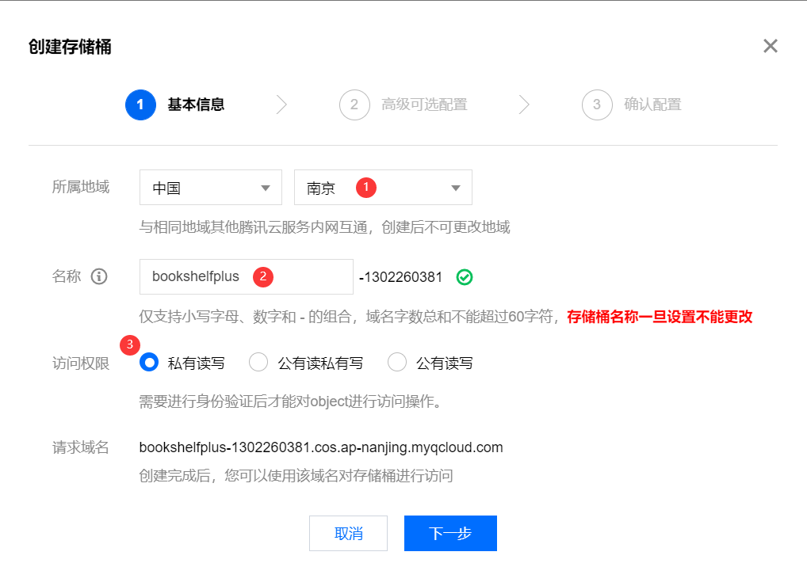
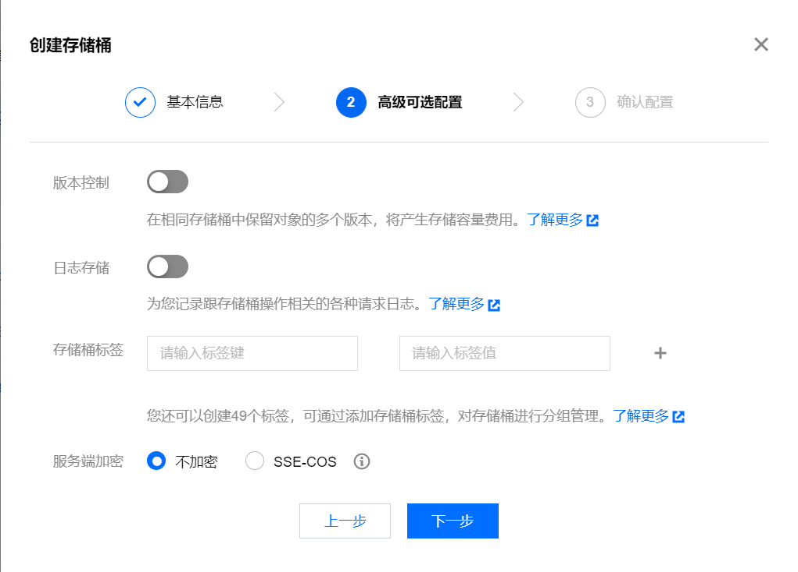
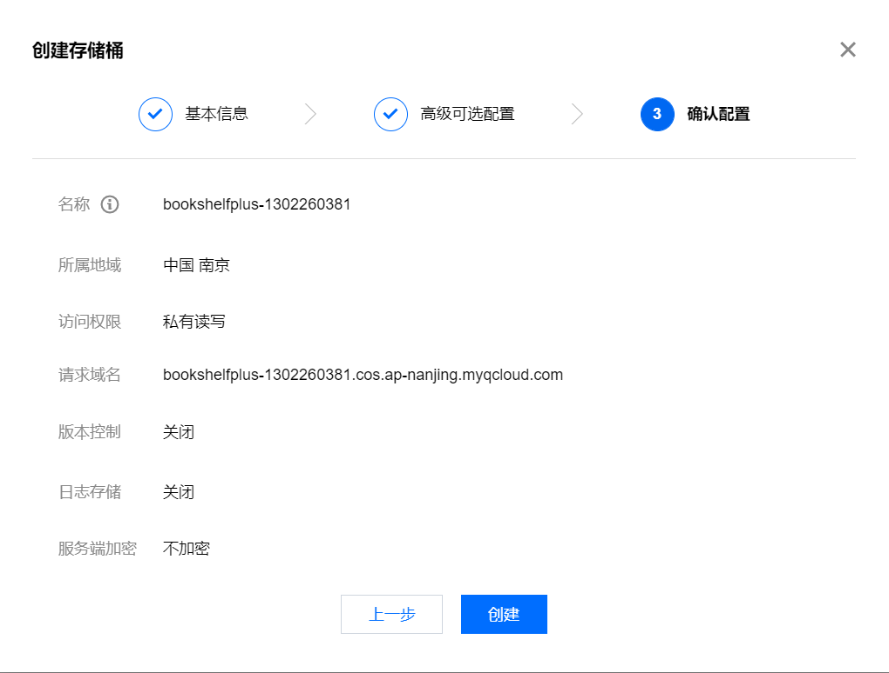
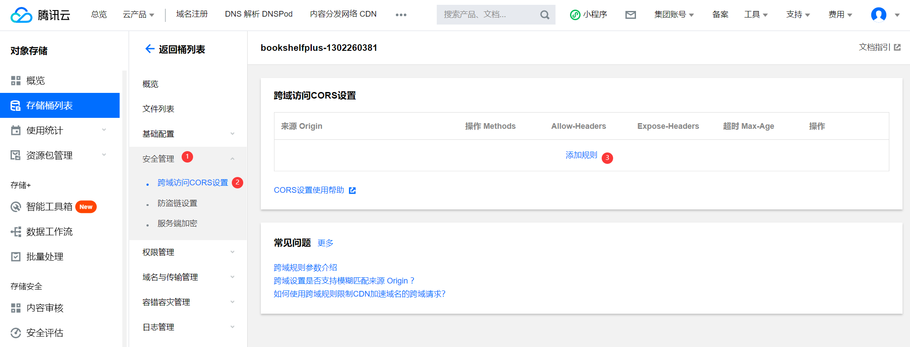
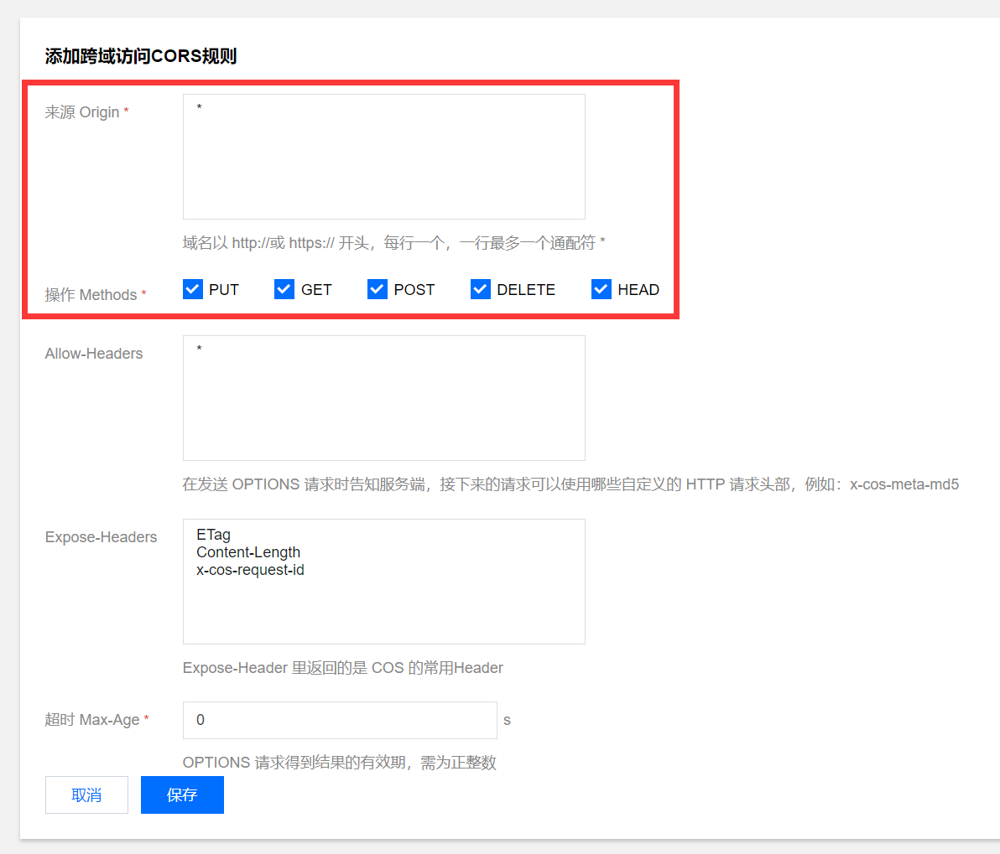
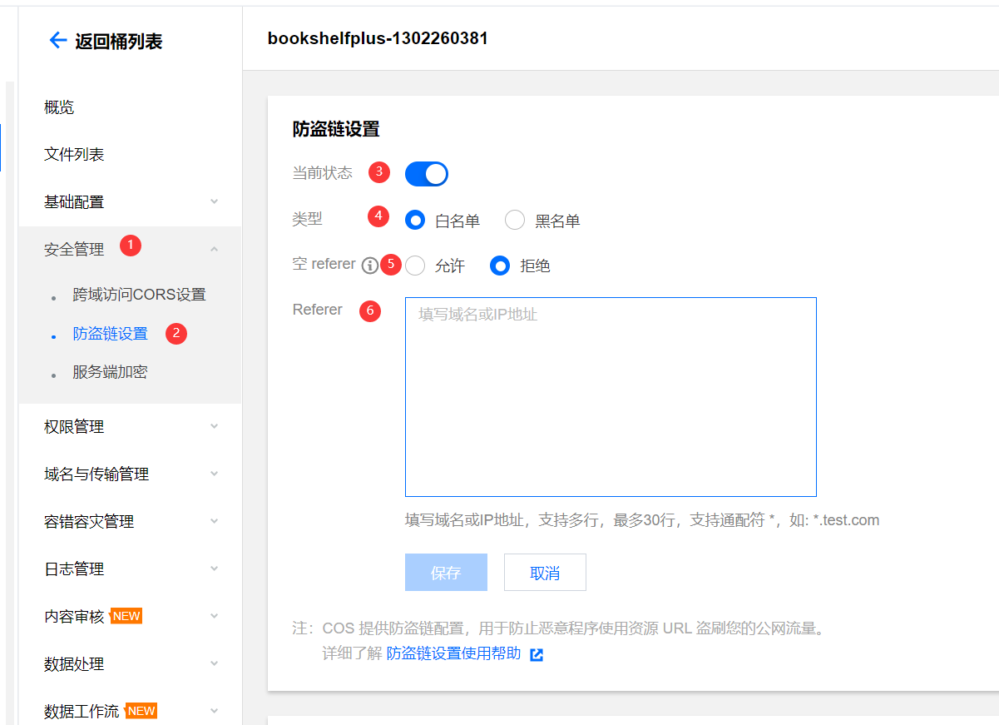
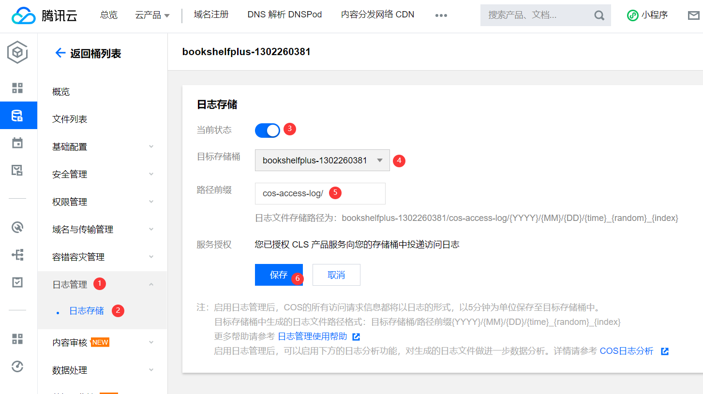

# 腾讯云对象存储配置

> 开始之前，你需要有一个腾讯云账号。
>
> 同时，请注意，腾讯云对象存储是收费服务，使用之前建议您了解一下收费模式再进行使用，以免产生不必要的费用。

首先登录腾讯云控制台，进入对象存储页面：

https://console.cloud.tencent.com/cos/bucket

## 创建存储桶

高级可选配置可以根据自己实际需求进行配置，此处保持默认不做更改。

点击创建，完成存储桶的创建。

## 配置存储桶

### 配置跨域访问

由于腾讯云存储桶和我们的业务域名不在同一主域下，所以需要配置 CORS 跨域访问，否则浏览器请求的时候会出现报错，无法完成请求。

> 如果您不了解 CORS 是什么的话，建议您阅读一下这篇 MDN 文档：[跨源资源共享CORS](https://developer.mozilla.org/zh-CN/docs/Web/HTTP/CORS)（其中的描述可能有些专业，大概看看就好）
>
> 也可以看一下腾讯云的官方文档：[设置跨域访问](https://cloud.tencent.com/document/product/436/13318)

这里添加一条**跨域访问CORS规则**

**来源 Origin** 填写自己的业务域名，注意后续对存储桶的请求需要通过此域名发出。如果您只是自己本地测试，方便起见可以直接填写 `*` ，但是如果您希望向他人分享，您最好还是设置一下，否则容易被别人刷流量。

**操作 Methods** 可以全部勾上。目前项目使用到的由 `PUT`，`GET` 和 `DELETE` 三种。

其余配置保持默认即可。

配置好后点击保存即可。

### 配置防盗链（可选）

这个配置不配不会影响业务正常使用，但是强烈建议您配置一下。因为不配置的话其他人可以将您的下载链接嵌入他们的网站，这样的话您需要为其支付费用。

> referer 在浏览器发请求的时候会将所在的网站域名通过 referer 请求标头发给服务端。③ 空 referer 一般指的是用户直接访问资源链接，而不是通过点击网页上的超链接访问的情景（也可能是通过设置了不发送 referer 请求头的网页访问过来），自己视情况设置。
>
> 防盗链可以参考腾讯云官方文档：[防盗链](https://cloud.tencent.com/document/faq/436/56651)

### 配置 CDN 加速域名（TODO）

> 参考腾讯云官方文档：[CDN 加速域名](https://cloud.tencent.com/document/faq/436/56558)

#### 默认 CDN 加速域名

#### 自定义 CDN 加速域名

TODO

上传：后端生成带有效期的预授权URL，前端使用这个 URL 进行上传。

下载：后端计算好 CDN 回源鉴权返回给前端，前端通过这个鉴权 URL 下载文件。

### 配置日志记录（可选）

如果您需要开启日志记录，可以按照下图步骤进行配置，如果不需要就不配置。

