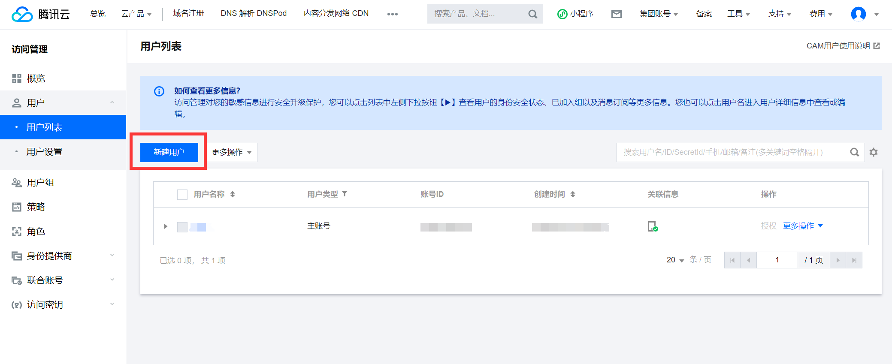
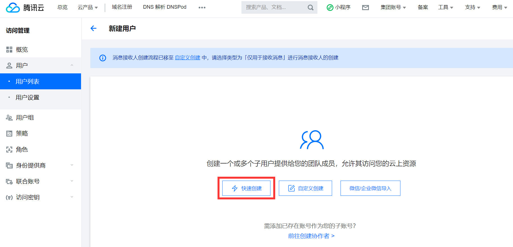
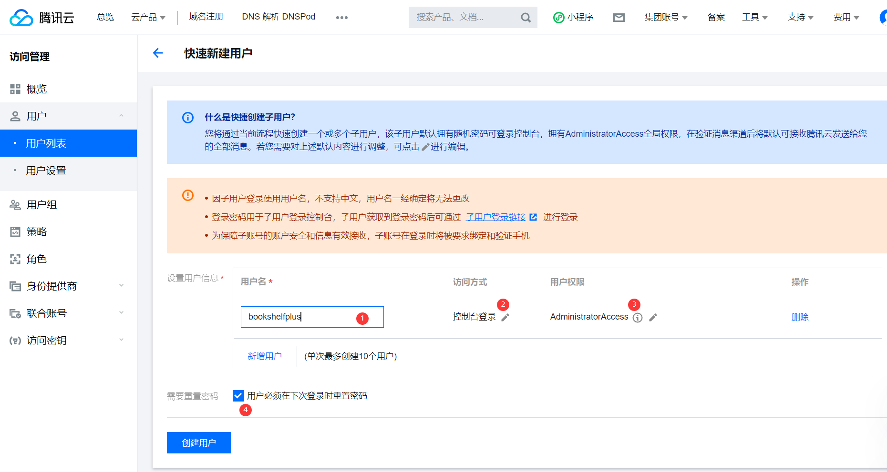
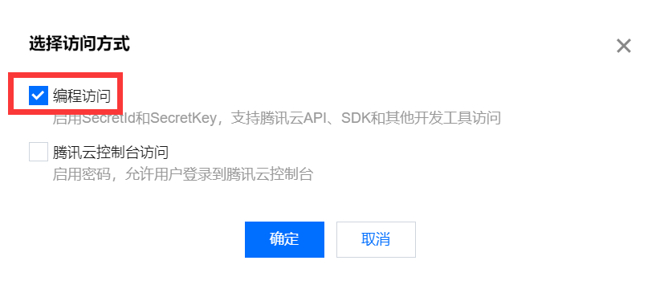
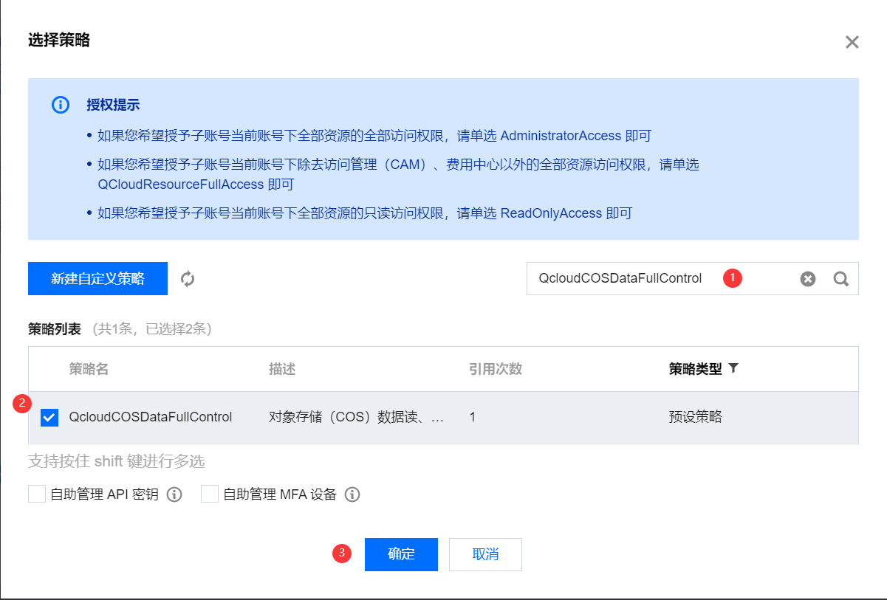
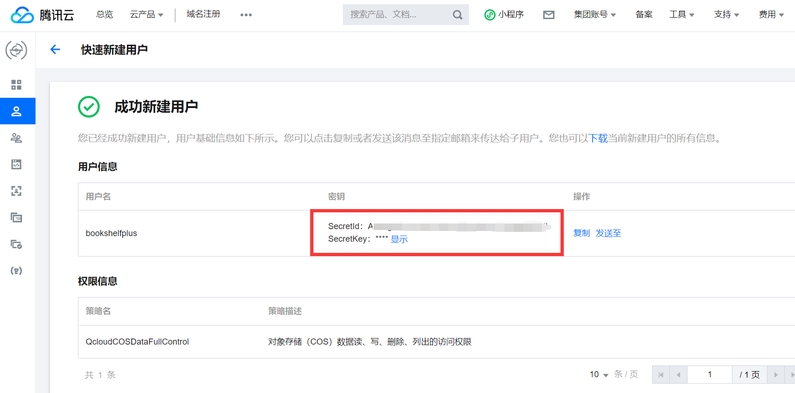
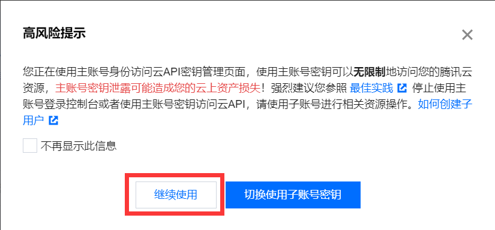
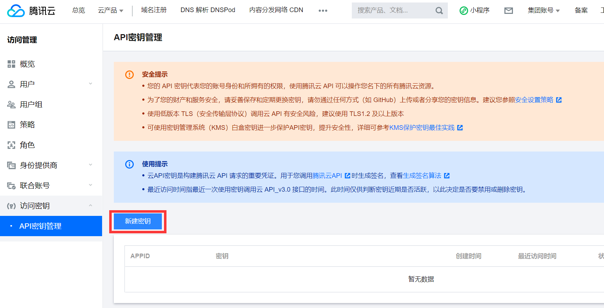
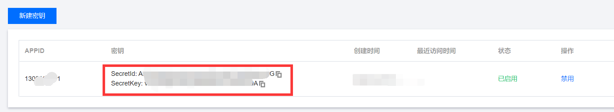

# 腾讯云生成SecretId、SecretKey

有两种方式，一种是创建子用户，然后生成子用户的SecrectKey，另一种是直接生成当前账号的SecrectKey。两种方式均可。如果您对权限管理有需求，建议使用第一种；如果您希望尽可能简单的配置，可以使用第二种。如果您不确定使用哪种，那么请用第一种。

## 第1种：创建子用户

登录腾讯云后台，进入访问管理下的用户列表页：https://console.cloud.tencent.com/cam

点击新建用户

点击快速创建。

接下来这里有四个地方需要配置。下图仅标出需要配置的项目，具体应该配置成什么请继续往下看。

> ① 用户名：自己随便起一个，满足要求即可。（用户名创建后不可以修改）
>
> ② 访问方式：修改为编程访问。
>
> 
>
> ③ 用户权限：
>
> <1> 取消 `AdministratorAccess` 权限；
>
> <2> 搜索 `QcloudCOSDataFullControl` ，并勾选 `QcloudCOSDataFullControl` （对象存储（COS）数据读、写、删除、列出的访问权限）
>
> 
>
> ④ 根据自己的情况选择即可

点击创建用户，用户创建成功，获得密钥。

## 第2种：直接生成

访问：https://console.cloud.tencent.com/cam/capi

点击继续使用。

点击新建密钥。

密钥创建完成。

